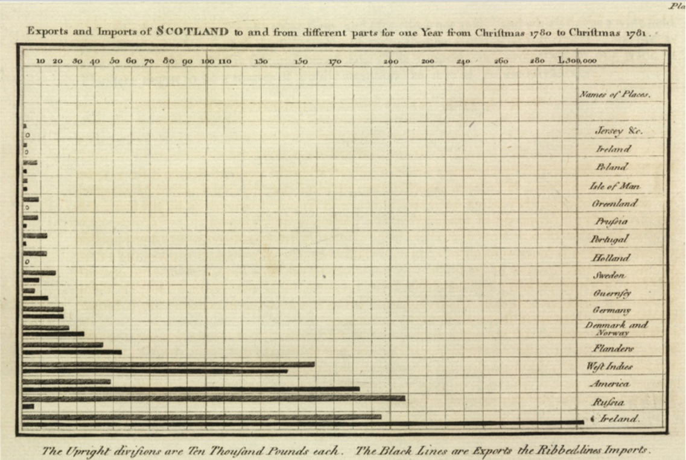
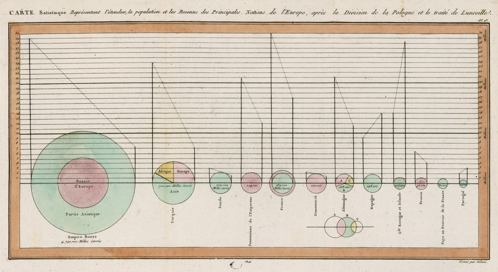

# https://yohman.github.io/26-2-Dataviz/

#

<!-- _class: tufte-slide -->

  
  
  

    
EDWARD TUFTE · 1983

    <h1>“Probably the best statistical graphic ever drawn.”</h1>
    
<em>The Visual Display of Quantitative Information</em>

    
Portrait: Keegan Peterzell, CC BY-SA 4.0 · Book cover: Edward Tufte / Graphics Press

  

#

<!-- _class: minard-slide -->

<medium>Charles Joseph Minard (1781–1870)</medium>

<small>Illustrative reconstruction, not an archival portrait</small>

#

#

<large>William Playfair (1786)</large>

#

<!-- _class: playfair-book-slide -->

  
  

    
WILLIAM PLAYFAIR · 1786

    <h1><em>The Commercial and Political Atlas</em></h1>
    
First published in 1786 Third-edition title page shown, 1801

  

#

<!-- _class: playfair-gallery -->

<h1>Playfair's visual language</h1>

  <figure>
    
    <figcaption><strong>TIME SERIES · 1786</strong>輸出入の変化と差を、線と面で見せる</figcaption>
  </figure>
  <figure>
    
    <figcaption><strong>BAR CHART · 1786</strong>国・地域ごとの量を、同じ尺度で比較する</figcaption>
  </figure>
  <figure>
    
    <figcaption><strong>CIRCLE &amp; PIE · 1801</strong>面積と分割で、規模と構成を一枚に示す</figcaption>
  </figure>

#

https://pudding.cool/2024/11/love-songs/

#

https://pudding.cool/2025/06/hello-stranger/

#

# In-Class Activity 1 – Visualization Showcase
**学生グループによる探究・共有ワーク**

<!-- _class: activity-slide -->

# 好きなデータ可視化を探す

  
<strong>1　探す</strong> グループで「これはすごい」と思う事例を見つける

  
<strong>2　選ぶ</strong> 話し合って、クラスに見せたい事例を一つ選ぶ

  
<strong>3　共有する</strong> 画面を見せながら、魅力を説明する

何のデータ？　なぜ目を引く？　色・配置・構造はどう効いている？

# 

# How much do you trust data?

Data on Google sheet: [View the sheet](https://docs.google.com/spreadsheets/d/1YQdCE-eggOzL-J-Ozc7aiUIetkgX2gwaif-yYveDJhk/edit?usp=sharing)

# In-Class Activity 2

# Why Visualize: Statistics Can Mislead

<column>

1. **Anscombe's Quartet** を Google Sheets で全体表示  
   - 平均・分散などは同じでも、散布図にすると全く異なる  
   - 目で見ることの重要性を再確認  

2. **Datasaurus Dozen** を使って、実際にプロット体験  
   - 各自ランダムにデータセットを配布し、散布図を作成  
   - 形が「恐竜」「X字」などになっていることに驚く

</column>

# Same stats, different story

データの統計量が同じでも、可視化しないと本質がわからない

<!-- _class: workflow-slide -->

# Data Visualization Workflow

  
01<strong>Raw Data</strong>生データ

  
02<strong>Wrangle</strong>クレンジング

  
03<strong>Explore</strong>分析

  
04<strong>Design</strong>可視化プラン

  
05<strong>Code</strong>コーディング

  
06<strong>Visualization</strong>完成・発信

