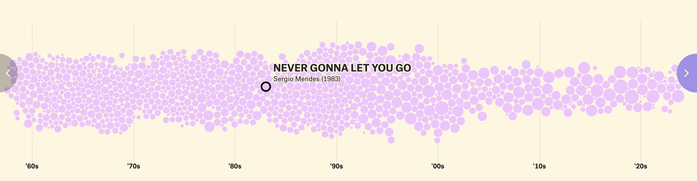
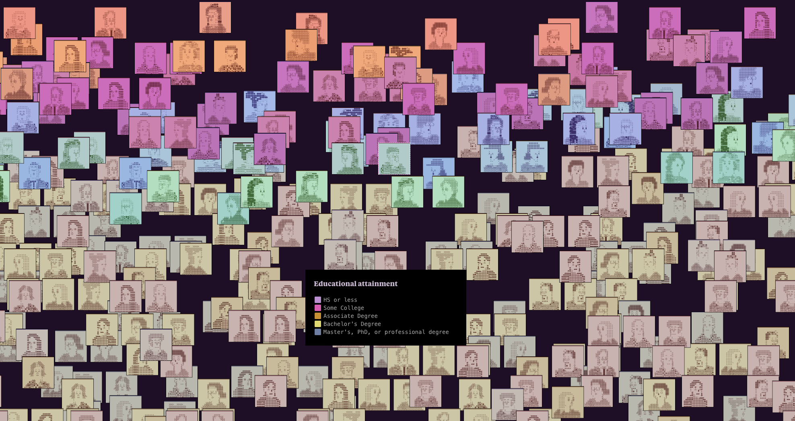
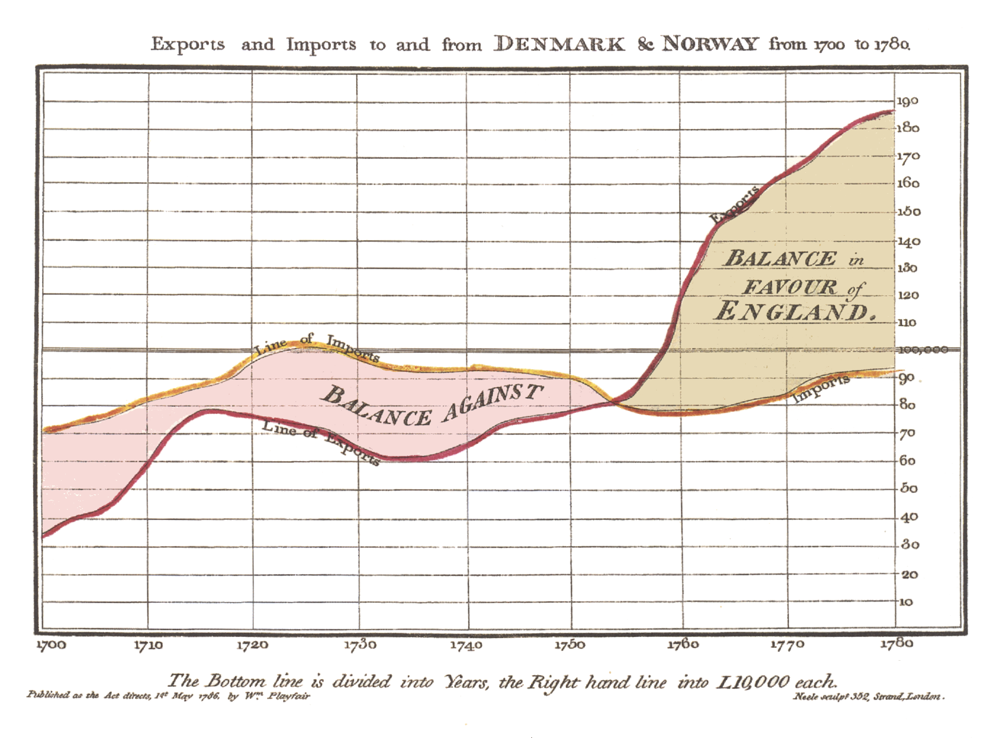
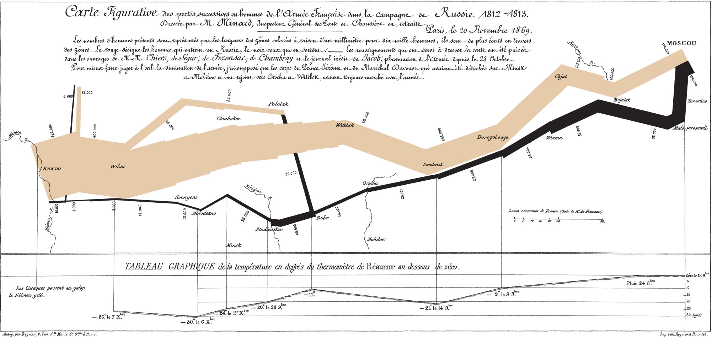
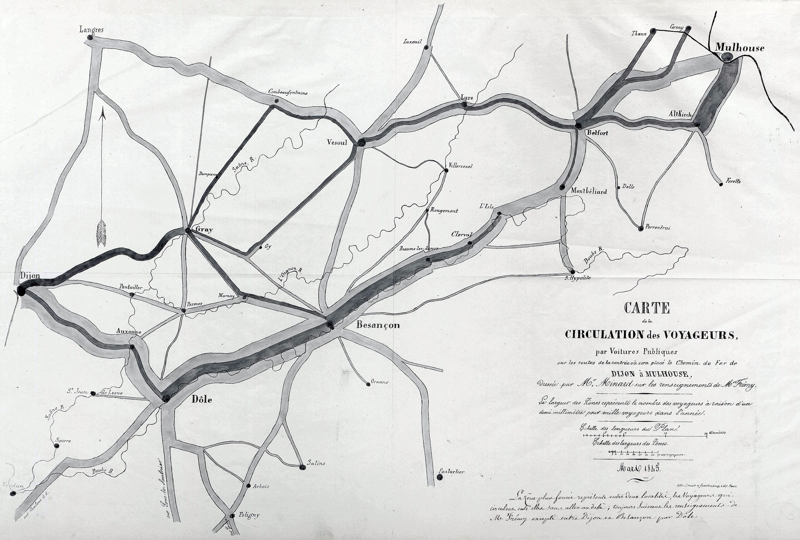
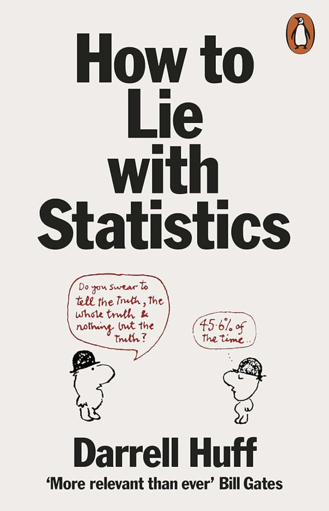
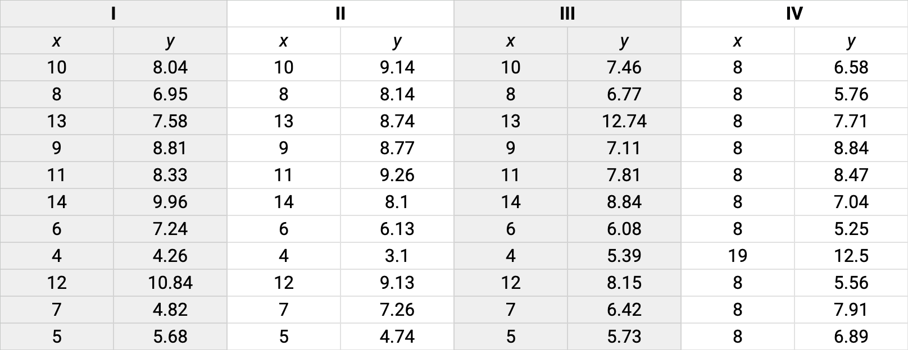

# https://yohman.github.io/26-2-Dataviz/

#

# Data + Visualization = 
# Visual Encoding Theory
視覚的エンコーディング理論

Position > Length > Angle > Area > Color

#

https://pudding.cool/2024/11/love-songs/

#

https://pudding.cool/2025/06/hello-stranger/ 

#

<large>William Playfair (1786)</large>

# Playfair's trade-balance time-series chart

Published in Commercial and Political Atlas, 1786

#

#

Charles Joseph Minard (1869)

#

#

# In-Class Activity 1 – Visualization Showcase
**学生グループによる探究・共有ワーク**

# デザインリテラシーを「発見」から始める 

<column>

1. グループに分かれ、オンラインで <medium>This is amazing!</medium> なデータ可視化の事例を見つける  
2. グループ内で意見を出し合い、1つ代表を選出  
3. クラス全体でシェアし、以下のポイントを説明：
   - どんなデータが使われていそうか？（出典・構造）  
   - なぜこのビジュアルは魅力的か？  
   - 伝わる理由・構造・色・配置など、デザインの工夫

</column>

# 

# How much do you trust data?

Data on Google sheet: [View the sheet](https://docs.google.com/spreadsheets/d/1YQdCE-eggOzL-J-Ozc7aiUIetkgX2gwaif-yYveDJhk/edit?usp=sharing)

# In-Class Activity 2

# Why Visualize: Statistics Can Mislead

<column>

1. **Anscombe's Quartet** を Google Sheets で全体表示  
   - 平均・分散などは同じでも、散布図にすると全く異なる  
   - 目で見ることの重要性を再確認  

2. **Datasaurus Dozen** を使って、実際にプロット体験  
   - 各自ランダムにデータセットを配布し、散布図を作成  
   - 形が「恐竜」「X字」などになっていることに驚く

</column>

# Same stats, different story

データの統計量が同じでも、可視化しないと本質がわからない

# Data Visualization Workflow

<medium>Raw Data     → 生データ  </medium>
     ↓  
<medium>Wrangle      → クレンジング  </medium>
     ↓  
<medium>Explore      → 分析  </medium>
     ↓  
<medium>Design       → 可視化プラン  </medium>
     ↓  
<medium>Code         → コーディング  </medium>
     ↓  
<medium>Visualization → 完成・発信  </medium>
